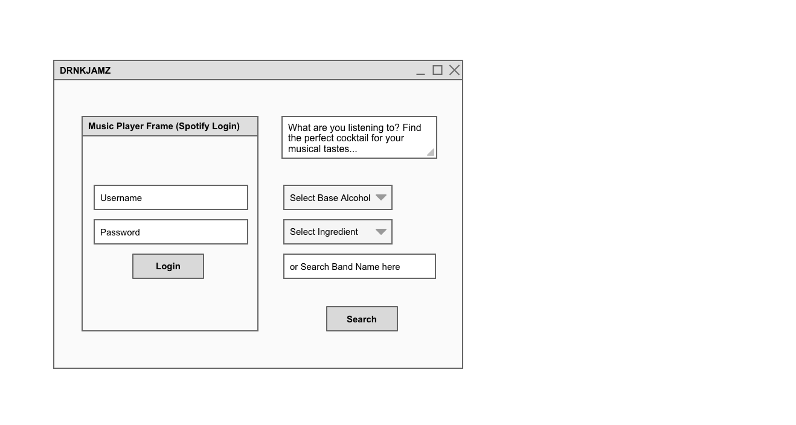
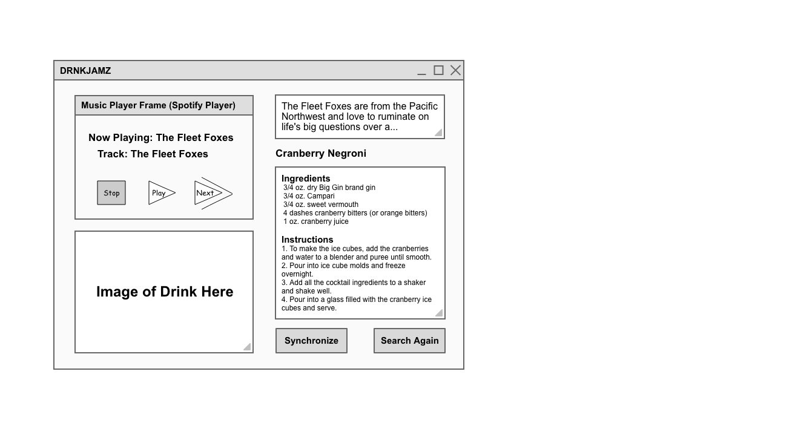

# drink-jamz
DRNKJAMZ

Concept: Visitors to the site can login to their Spotify, etc account and stream songs either free or paid. The website will search a database/API of cocktails and recommend pairings based on hometown of artist and other attributes of the artists' musical style or perhaps track attributes from Spotify API.

## MVP:
1. Visitors can search for an Artist via the landing page search box if they do not want to use the player
2. Visitors will see a cocktail recipe from CocktailDB API on the Results page derived from the Artist's attributes like hometown and genre.
3. Visitors can Search Again to randomly generate a different cocktail.

## Extras:
1. Include embedded Spotify web player
2. Optimize for mobile operation
3. Implement users to save favorite cocktails
4. Allow user to select a base alcohol and ingredient from a drop-down for more personalized recipes
5. Stretch goal - Potentially recommend an artist from an alcohol and ingredient and genre?
6. Super stretch goal - implement MusixMatch API to search all band lyrics to improve relationship algorithm
7. Only if lots of time left goal - implement Pandora, Deezer, Prime Music, Apple Music, etc integration

## User Stories
MVP
* Visit landing page
* Fill in musical artist in text box
* Seach for matching cocktail and get result
* Search again for alternate random cocktail.

EXTRA
* Login to landing page with user account (Spotify Connect?)
* Visit your favorited cocktails or recent searches home page
* Search for an Artist name in Navbar, potentially specifying an ingredient or two
* Get matching cocktails for search criteria.
* Search again for alternate random cocktail.
* Search for artist from cocktail ingredients and genre?

  
  